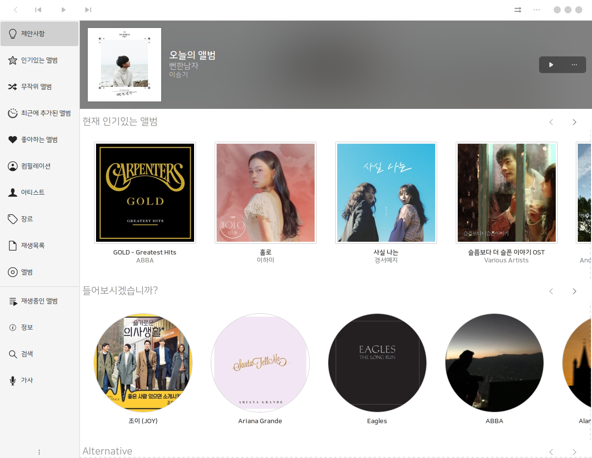
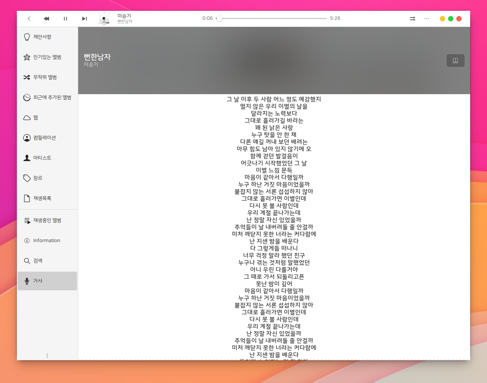
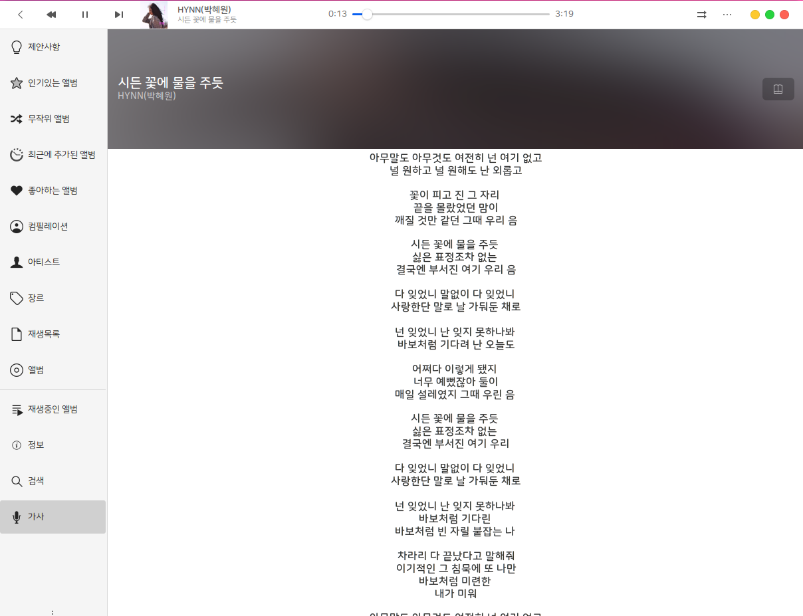

# Lollypop music player for HamoniKR







이 프로젝트는 최신 lollypop 소스를 하모니카에서 사용할 수 있도록 패키징해서 제공합니다.

 * upstream : https://gitlab.gnome.org/World/lollypop
 * 한국어 번역 : https://hosted.weblate.org/projects/gnumdk/lollypop/ko/

## How to build on HamoniKR (>= 4.0)

 1) `gir1.2-handy-1` 패키지가 기본으로 제공되지 않기 때문에 아래와 같이 PPA 추가 후 설치
```
sudo add-apt-repository ppa:apandada1/libhandy-1
sudo apt update
``` 
 2) 필요 패키지 설치 및 데비안 패키지 생성
```
sudo apt-get install meson libglib2.0-dev yelp-tools libgirepository1.0-dev libgtk-3-dev gir1.2-totemplparser-1.0 python-gi-dev

dpkg-buildpackage
```

# Lollypop music player


Support Lollypop: https://www.patreon.com/gnumdk

Lollypop is a new GNOME music playing application.

- Users: https://wiki.gnome.org/Apps/Lollypop

- Translators: https://hosted.weblate.org/projects/gnumdk/

- Contributions: https://gitlab.gnome.org/World/lollypop/-/wikis/Contributions

It provides:

- MP3/4, Ogg and FLAC.
- Genre/cover browsing
- Genre/artist/cover browsing
- Search
- Main playlist (called queue in other apps)
- Party mode
- ReplayGain
- Cover art downloader
- Context artist view
- MTP sync
- Fullscreen view
- Radio support
- Last.fm support
- Auto install codecs
- HiDPI support
- TuneIn support

## Depends on

- `gtk3 >= 3.20`
- `gobject-introspection`
- `appstream-glib`
- `gir1.2-gstreamer-1.0 (Debian)`
- `python3`
- `libhandy1`
- `meson >= 0.40`
- `ninja`
- `totem-plparser`
- `python-gst`
- `python-cairo`
- `python-gobject`
- `python-sqlite`
- `beautifulsoup4`

## Building from Git

```bash
$ git clone https://gitlab.gnome.org/World/lollypop.git
$ cd lollypop
$ meson builddir --prefix=/usr/local
# sudo ninja -C builddir install
```

### On Debian/Ubuntu

```bash
$ git clone https://gitlab.gnome.org/World/lollypop.git
$ cd lollypop
# apt-get install meson libglib2.0-dev yelp-tools libgirepository1.0-dev libgtk-3-dev gir1.2-totemplparser-1.0 python-gi-dev
$ meson builddir --prefix=/usr/local
# sudo ninja -C builddir install
```

### On Fedora

```bash
$ git clone https://gitlab.gnome.org/World/lollypop.git
$ cd lollypop
# sudo dnf install meson glib2-devel yelp-tools gtk3-devel gobject-introspection-devel python3 pygobject3-devel libsoup-devel
$ meson builddir --prefix=/usr/local
# sudo ninja -C builddir install
```

[](https://repology.org/project/lollypop/versions)
